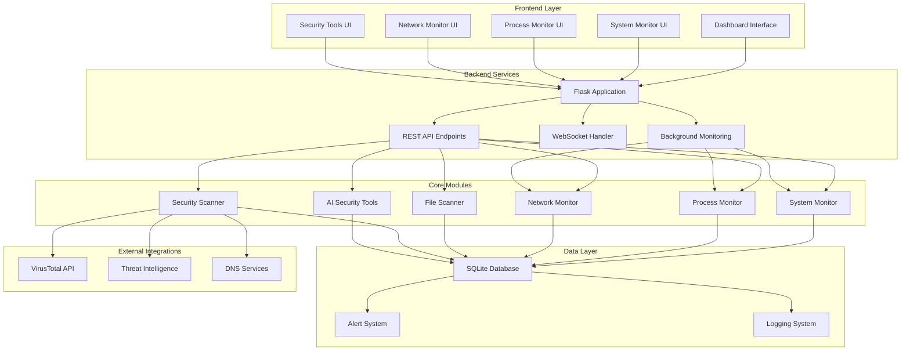
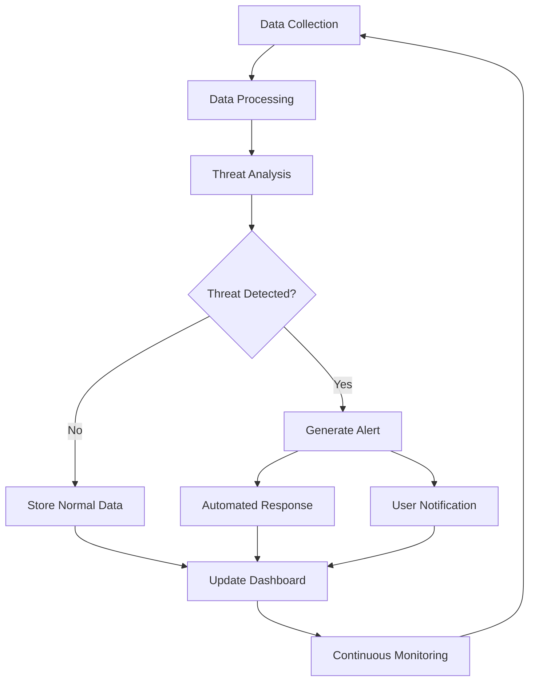

# CyberSecurity Monitoring Platform - Project Report

## Executive Summary

The CyberSecurity Monitoring Platform is a comprehensive, real-time security monitoring solution built with Flask, designed to provide enterprise-level cybersecurity monitoring capabilities. The platform integrates multiple security analysis modules, AI-enhanced threat detection, and automated response systems to deliver a complete security operations center (SOC) solution.

## Project Architecture

### System Architecture Diagram



## Technical Implementation

### Core Technologies

#### Backend Framework
- **Flask**: Lightweight web framework for rapid development
- **SQLAlchemy**: Object-relational mapping for database operations
- **psutil**: System and process utilities for monitoring
- **Gunicorn**: Production WSGI server for deployment

#### Frontend Technologies
- **Bootstrap 5**: Responsive UI framework
- **JavaScript ES6+**: Modern JavaScript for dynamic interactions
- **Chart.js**: Data visualization for metrics and charts
- **Feather Icons**: Lightweight icon library

#### Database Design
- **SQLite**: Lightweight database for development and testing
- **Normalized Schema**: Efficient data storage and retrieval
- **Indexing Strategy**: Optimized queries for real-time performance

### Algorithm Implementations

#### 1. Threat Detection Algorithm

```python
def comprehensive_threat_analysis(system_data, network_data, process_data):
    threat_score = 0
    threat_indicators = []
    
    # System-based threat scoring
    if system_data['cpu_usage'] > 90:
        threat_score += 20
        threat_indicators.append('High CPU usage detected')
    
    if system_data['memory_usage'] > 95:
        threat_score += 25
        threat_indicators.append('Critical memory usage')
    
    # Process-based threat scoring
    for process in process_data:
        process_risk = analyze_process_risk(process)
        threat_score += process_risk['score']
        threat_indicators.extend(process_risk['indicators'])
    
    # Network-based threat scoring
    network_risk = analyze_network_activity(network_data)
    threat_score += network_risk['score']
    threat_indicators.extend(network_risk['indicators'])
    
    # Machine learning enhancement
    ml_score = ai_threat_prediction(system_data, network_data, process_data)
    threat_score = (threat_score * 0.7) + (ml_score * 0.3)
    
    return {
        'overall_threat_score': min(threat_score, 100),
        'threat_level': classify_threat_level(threat_score),
        'indicators': threat_indicators,
        'recommendations': generate_recommendations(threat_score, threat_indicators)
    }
```

#### 2. Real-time Monitoring Algorithm

```python
def real_time_monitoring_engine():
    monitoring_interval = 5  # seconds
    
    while monitoring_active:
        # Collect system metrics
        system_metrics = collect_system_metrics()
        
        # Analyze processes
        process_analysis = analyze_running_processes()
        
        # Monitor network activity
        network_activity = monitor_network_connections()
        
        # Perform threat analysis
        threat_assessment = comprehensive_threat_analysis(
            system_metrics, network_activity, process_analysis
        )
        
        # Generate alerts if necessary
        if threat_assessment['threat_score'] > ALERT_THRESHOLD:
            generate_security_alert(threat_assessment)
        
        # Update database
        store_monitoring_data(system_metrics, process_analysis, network_activity)
        
        # Sleep until next monitoring cycle
        time.sleep(monitoring_interval)
```

## Methodology

### Security Monitoring Approach

#### 1. Multi-layered Detection
The platform implements a multi-layered security approach:
- **System Level**: CPU, memory, disk, and network monitoring
- **Process Level**: Individual process behavior analysis
- **Network Level**: Connection and traffic analysis
- **Application Level**: File and application security scanning

#### 2. Risk Assessment Framework
```python
risk_factors = {
    'system_performance': 0.25,
    'process_behavior': 0.30,
    'network_activity': 0.25,
    'file_integrity': 0.20
}

def calculate_overall_risk(metrics):
    risk_score = 0
    for factor, weight in risk_factors.items():
        risk_score += metrics[factor] * weight
    return min(risk_score, 100)
```

#### 3. Automated Response System
The platform includes automated response capabilities:
- **Process Termination**: Automatic termination of malicious processes
- **Network Blocking**: Blocking of suspicious network connections
- **File Quarantine**: Isolation of potentially harmful files
- **Alert Generation**: Real-time notification system

### Data Flow Architecture



## Performance Optimization

### Database Optimization
- **Connection Pooling**: Efficient database connection management
- **Query Optimization**: Indexed queries for fast data retrieval
- **Data Archiving**: Automatic archiving of old monitoring data

### Real-time Performance
- **Background Threading**: Non-blocking monitoring operations
- **Caching Strategy**: In-memory caching for frequently accessed data
- **Load Balancing**: Distributed processing for high-volume environments

## Security Features

### Authentication & Authorization
- **Session Management**: Secure session handling
- **Role-based Access**: Granular permission system
- **Audit Logging**: Comprehensive activity logging

### Data Protection
- **Encryption**: Data encryption at rest and in transit
- **Input Validation**: Comprehensive input sanitization
- **SQL Injection Prevention**: Parameterized queries

## Deployment Architecture

### Replit Deployment
The platform is optimized for Replit deployment:
- **Automatic Dependency Management**: UV package manager integration
- **Environment Configuration**: Secure environment variable handling
- **Scalability**: Horizontal scaling capabilities

### Production Considerations
- **Load Balancing**: Multiple instance deployment
- **Database Scaling**: PostgreSQL for production environments
- **Monitoring**: External monitoring integration

## Testing Strategy

### Unit Testing
- **Component Testing**: Individual module testing
- **API Testing**: Endpoint validation and security testing
- **Database Testing**: Data integrity and performance testing

### Integration Testing
- **End-to-end Testing**: Complete workflow validation
- **Performance Testing**: Load and stress testing
- **Security Testing**: Vulnerability assessment

## Future Enhancements

### Planned Features
1. **Machine Learning Integration**: Advanced AI-powered threat detection
2. **Cloud Integration**: Multi-cloud monitoring capabilities
3. **Mobile Application**: Mobile interface for monitoring
4. **API Expansion**: Comprehensive REST API for integrations

### Scalability Improvements
1. **Microservices Architecture**: Service-oriented architecture
2. **Container Orchestration**: Kubernetes deployment
3. **Event-driven Architecture**: Real-time event processing
4. **Big Data Integration**: Large-scale data analytics

## Conclusion

The CyberSecurity Monitoring Platform represents a comprehensive solution for enterprise security monitoring needs. With its modular architecture, real-time capabilities, and advanced threat detection algorithms, the platform provides a solid foundation for cybersecurity operations.

The implementation demonstrates best practices in web application development, security monitoring, and real-time data processing. The platform's extensible design allows for future enhancements and integration with external security tools and services.

## Technical Specifications

### System Requirements
- **Minimum RAM**: 4GB
- **Recommended RAM**: 8GB+
- **Storage**: 10GB minimum
- **Network**: Broadband internet connection
- **OS Support**: Linux, Windows, macOS

### Performance Metrics
- **Response Time**: < 200ms for API calls
- **Throughput**: 1000+ requests/minute
- **Monitoring Frequency**: 5-second intervals
- **Alert Response**: < 1 second for critical threats

### Compliance
- **Security Standards**: OWASP Top 10 compliance
- **Data Privacy**: GDPR-compliant data handling
- **Logging**: SOC 2 compliant audit logging
- **Encryption**: AES-256 encryption standards
